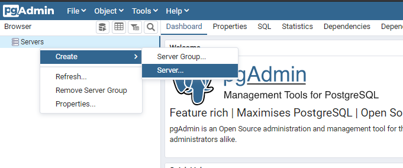
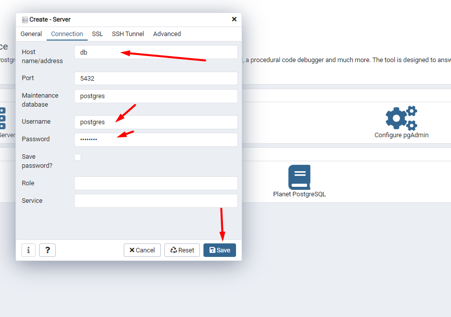
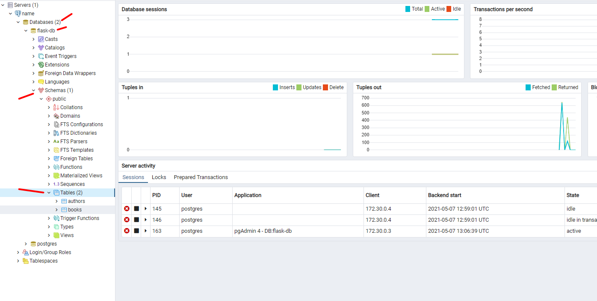

# flask-postgres-docker
Project on docker and docker-compose with Flask and Postgres


## Installation & Running
1. Copy `.env_example` to `.env`
2. Fill the values:
```dotenv
POSTGRES_SERVER=
POSTGRES_USER=
POSTGRES_PASSWORD=
POSTGRES_DB=
PGADMIN_LISTEN_PORT=
PGADMIN_DEFAULT_EMAIL=
PGADMIN_DEFAULT_PASSWORD=
MY_SECRET_VAR=
```
3. Run all the services with a simple command:
```docker
docker-compose up -d --build
```


## Usage
#### PGADMIN
To control the database use PGAdmin. </br>
- PGAdmin runs by default on 5050, so visit `localhost:5050`, and enter the details based on the `.env` file:
```dotenv
PGADMIN_DEFAULT_EMAIL=valon@gmail.com
PGADMIN_DEFAULT_PASSWORD=123123
```


- Configure details to connect to the instance. Based on the `.env` file you need to add `host,user,password` for your database. Going back from the `.env` it should be `POSTGRES_SERVER, POSTGRES_USER, POSTGRES_PASSWORD`


<br/>
Then fill the details:



Then you can navigate to the databse and the table that you have created.



#### FLASK

Flask will run on the port `5000`. Visit `localhost:5000` to access the backend api.
- Create an author:
```shell
curl --location --request POST 'localhost:5000/authors' \
--header 'Content-Type: application/json' \
--data-raw '{
    "name":"Valon"
}'
```

Response:
```shell
{
    "id": 1,
    "name": "Valon"
}
```

- Get all authors
```shell
curl -X GET http://localhost:5000/authors
```

Response:
```shell
[
  {
    "id": 1,
    "name": "Valon"
  }
]
```

- Get author by id
```shell
curl --location --request GET 'localhost:5000/authors/1' \
--header 'Content-Type: application/json' \
--data-raw '{
    "name":"Valon"
}'
```

Response:
```shell
  "id": 1,
  "name": "Valon"
}
```

p.s: You can also navigate to PGAdmin to see the latest changes

## Stop & Delete stack

To stop all the stack:
```docker
docker-compose down # will stop your containers, but it also removes the stopped containers as well as any networks that were created
or
docker-compose stop # will stop your containers, but it won't remove them
```
Stop and delete stack and volumes:
```docker
docker-compose down -v
```
